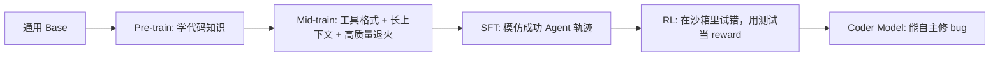
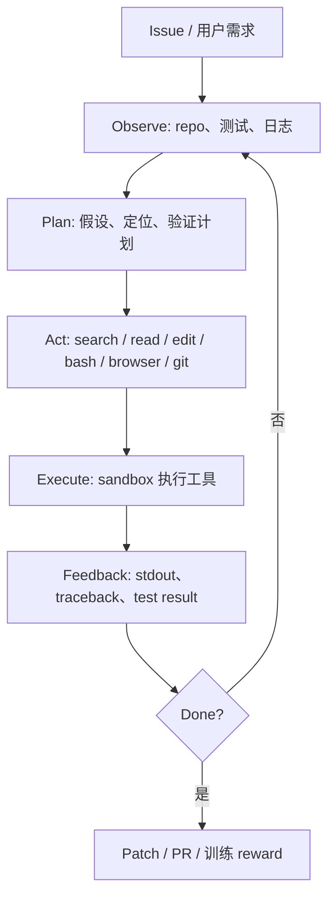

# Code Agent 知识库总览

⬅ [README](README.md) | ➡ [01-Code-Agent与Coder模型边界](01-Code-Agent%E5%BF%83%E6%99%BA%E6%A8%A1%E5%9E%8B/01-Code-Agent%E4%B8%8ECoder%E6%A8%A1%E5%9E%8B%E8%BE%B9%E7%95%8C.md)

> [!summary] 一句话
> 这个库回答一个问题：如何从一个通用 base 模型，训练出能读仓库、改代码、跑测试、根据反馈继续修的 **Coder Model / Code Agent Model**。

## 全流程心智图

## 🎬 故事比喻：从代码补全到软件工程闭环

把软件开发想成一家小型修车厂。

**Code LLM** 像一个会背维修手册的实习生：你问“怎么换轮胎”，它能写出标准步骤；你问“写个 quicksort”，它能给一段函数。它的强项是“给答案”。

**Code Agent** 像一个能进车间干活的初级技师：它会看工单、打开引擎盖、找零件、拧螺丝、点火测试；如果发动机还是响，它会再查、再改、再测。它的强项是“跑闭环”。

**Coder Model / Code Agentic RL** 则是一个会从每次维修成败里成长的技师：哪种检查路径更快，哪种改法容易引入回归，哪类报错应该先看哪个文件，这些不只靠师傅示范，还靠自己在沙箱里反复试错，用测试结果当反馈。

> [!tip] 本库的核心判断
> Code Agent 不是“会写代码的聊天机器人”，而是一个 **软件工程闭环系统**：issue -> repo navigation -> edit -> test -> debug -> patch -> review。

## 🔧 技术拆解：Code Agent 的最小闭环

和 [ReAct](../Hello-Agents/04-%E7%AC%AC4%E7%AB%A0-%E6%99%BA%E8%83%BD%E4%BD%93%E7%BB%8F%E5%85%B8%E8%8C%83%E5%BC%8F/02-ReAct%E8%8C%83%E5%BC%8F.md) 的关系很直接：ReAct 是“思考-行动-观察”的通用范式，Code Agent 把观察和行动换成真实软件工程对象：仓库、文件、shell、测试、git、CI。

和 [Claude Code queryLoop](../Claude-Code-Source/02-%E7%AC%AC2%E7%AB%A0-Agent-Loop%E4%B8%BB%E5%BE%AA%E7%8E%AF/02-queryLoop%E9%AA%A8%E6%9E%B6.md) 的关系也很直接：工业级 Code Agent 的主循环仍是“调模型 -> 收 tool_use -> 执行工具 -> 追加结果 -> 下一轮”，只是多了权限、安全、上下文压缩、并发和错误恢复。

## 🧪 例子：同一个需求，三类系统怎么做

| 用户说 | Code LLM | Code Agent | Coder Model 训练视角 |
|---|---|---|---|
| “修复 timeout=0 永久阻塞” | 猜测并生成一段 timeout 判断代码 | 搜索 `timeout`、读相关文件、修改、跑测试、看失败日志、再改 | 把整条轨迹和 F2P/P2P 测试结果变成 SFT/RL 信号 |
| “把登录页做成响应式” | 直接吐 HTML/CSS | 创建文件、打开浏览器、截图检查、调 CSS | 渲染规则和视觉评分形成验证器 |
| “解释这个 repo 的鉴权链路” | 概括常见鉴权模式 | 搜索 symbol、读调用链、生成结构化说明 | 代码理解任务可用路径/符号匹配做监督 |

## 核心阅读路径

| 顺序 | 笔记 | 你要抓住什么 |
|---|---|---|
| 1 | [01-Code-Agent与Coder模型边界](01-Code-Agent%E5%BF%83%E6%99%BA%E6%A8%A1%E5%9E%8B/01-Code-Agent%E4%B8%8ECoder%E6%A8%A1%E5%9E%8B%E8%BE%B9%E7%95%8C.md) | Code LLM、Code Agent、Coder Model 的边界 |
| 2 | [00-四阶段数据总览](02-%E6%95%B0%E6%8D%AE%E5%B7%A5%E7%A8%8B/00-%E5%9B%9B%E9%98%B6%E6%AE%B5%E6%95%B0%E6%8D%AE%E6%80%BB%E8%A7%88.md) | 四个阶段分别喂什么数据 |
| 3 | [01-Pre-train](03-%E8%AE%AD%E7%BB%83%E9%98%B6%E6%AE%B5/01-Pre-train.md) | CLM / FIM / repo-level 拓扑序 |
| 4 | [02-Mid-train](03-%E8%AE%AD%E7%BB%83%E9%98%B6%E6%AE%B5/02-Mid-train.md) | 工具调用、长上下文、退火 |
| 5 | [03-SFT](03-%E8%AE%AD%E7%BB%83%E9%98%B6%E6%AE%B5/03-SFT.md) | 成功轨迹、masking、packing、分流 |
| 6 | [04-RL](03-%E8%AE%AD%E7%BB%83%E9%98%B6%E6%AE%B5/04-RL.md) | rollout、sandbox、proxy、GRPO |
| 7 | [Reward-Hacking与Sandbox安全](05-Reward%E4%B8%8E%E7%A8%B3%E5%AE%9A%E6%80%A7/Reward-Hacking%E4%B8%8ESandbox%E5%AE%89%E5%85%A8.md) | reward hacking 与安全边界 |

## 本库目录

| 目录 | 作用 |
|---|---|
| [Code-Agent落地路线](00-MOC/Code-Agent%E8%90%BD%E5%9C%B0%E8%B7%AF%E7%BA%BF.md) | 从学习到落地的路线 |
| [Coder模型训练全流程地图](00-MOC/Coder%E6%A8%A1%E5%9E%8B%E8%AE%AD%E7%BB%83%E5%85%A8%E6%B5%81%E7%A8%8B%E5%9C%B0%E5%9B%BE.md) | 训练阶段导航图 |
| [01-Code-Agent与Coder模型边界](01-Code-Agent%E5%BF%83%E6%99%BA%E6%A8%A1%E5%9E%8B/01-Code-Agent%E4%B8%8ECoder%E6%A8%A1%E5%9E%8B%E8%BE%B9%E7%95%8C.md) | 定义、边界、能力栈 |
| [00-四阶段数据总览](02-%E6%95%B0%E6%8D%AE%E5%B7%A5%E7%A8%8B/00-%E5%9B%9B%E9%98%B6%E6%AE%B5%E6%95%B0%E6%8D%AE%E6%80%BB%E8%A7%88.md) | 数据形态与验证器 |
| [01-Pre-train](03-%E8%AE%AD%E7%BB%83%E9%98%B6%E6%AE%B5/01-Pre-train.md) | 四个训练阶段 |
| [01-Agent工程闭环总览](04-Agent%E5%B7%A5%E7%A8%8B%E9%97%AD%E7%8E%AF/01-Agent%E5%B7%A5%E7%A8%8B%E9%97%AD%E7%8E%AF%E6%80%BB%E8%A7%88.md) | scaffold、sandbox、proxy、trajectory |
| [Reward-Hacking与Sandbox安全](05-Reward%E4%B8%8E%E7%A8%B3%E5%AE%9A%E6%80%A7/Reward-Hacking%E4%B8%8ESandbox%E5%AE%89%E5%85%A8.md) | reward、安全、稳定性 |
| [00-章节总览](06-%E6%A1%88%E4%BE%8B%E4%B8%8E%E8%AE%BA%E6%96%87%E5%8D%A1/00-%E7%AB%A0%E8%8A%82%E6%80%BB%E8%A7%88.md) | SWE-bench、SWE-agent、OpenHands、Aider、Claude Code、Codex、SWE-Gym、SWE-smith |
| [术语表](90-%E9%99%84%E5%BD%95/%E6%9C%AF%E8%AF%AD%E8%A1%A8.md) | 术语、自测、跨库索引、原始资料 |

## 跨库桥接

| 你想补什么 | 去哪里 |
|---|---|
| LLM 训练基础 | [04-训练三阶段全景](../Happy-LLM/04-%E7%AC%AC4%E7%AB%A0-%E5%A4%A7%E8%AF%AD%E8%A8%80%E6%A8%A1%E5%9E%8B/04-%E8%AE%AD%E7%BB%83%E4%B8%89%E9%98%B6%E6%AE%B5%E5%85%A8%E6%99%AF.md)、[00-章节总览](../Happy-LLM/06-%E7%AC%AC6%E7%AB%A0-%E5%A4%A7%E6%A8%A1%E5%9E%8B%E8%AE%AD%E7%BB%83%E6%B5%81%E7%A8%8B%E5%AE%9E%E8%B7%B5/00-%E7%AB%A0%E8%8A%82%E6%80%BB%E8%A7%88.md) |
| Agent 基础范式 | [00-章节总览](../Hello-Agents/04-%E7%AC%AC4%E7%AB%A0-%E6%99%BA%E8%83%BD%E4%BD%93%E7%BB%8F%E5%85%B8%E8%8C%83%E5%BC%8F/00-%E7%AB%A0%E8%8A%82%E6%80%BB%E8%A7%88.md) |
| 上下文工程 | [00-章节总览](../Hello-Agents/09-%E7%AC%AC9%E7%AB%A0-%E4%B8%8A%E4%B8%8B%E6%96%87%E5%B7%A5%E7%A8%8B/00-%E7%AB%A0%E8%8A%82%E6%80%BB%E8%A7%88.md)、[00-章节总览](../Claude-Code-Source/04-%E7%AC%AC4%E7%AB%A0-%E4%B8%8A%E4%B8%8B%E6%96%87%E7%AE%A1%E7%90%86/00-%E7%AB%A0%E8%8A%82%E6%80%BB%E8%A7%88.md) |
| 工业级 Code Agent | [00-章节总览](../Claude-Code-Source/02-%E7%AC%AC2%E7%AB%A0-Agent-Loop%E4%B8%BB%E5%BE%AA%E7%8E%AF/00-%E7%AB%A0%E8%8A%82%E6%80%BB%E8%A7%88.md)、[00-章节总览](../Claude-Code-Source/03-%E7%AC%AC3%E7%AB%A0-%E5%B7%A5%E5%85%B7%E7%B3%BB%E7%BB%9F/00-%E7%AB%A0%E8%8A%82%E6%80%BB%E8%A7%88.md) |
| Code Agentic RL | [00-章节总览](../agentic-rl-knowledge-base/04-%E7%AC%AC4%E7%AB%A0-Code-Agentic-RL%E4%B8%93%E9%A2%98/00-%E7%AB%A0%E8%8A%82%E6%80%BB%E8%A7%88.md) |

## 先读 Agentic-RL，还是先读本库？

| 你的当前状态 | 推荐 |
|---|---|
| RL / GRPO / RLVR 不熟 | 先读 [00-总览](../agentic-rl-knowledge-base/00-%E6%80%BB%E8%A7%88.md)，再回本库 |
| 已知道 Code Agentic RL，想落地训练流程 | 直接读 [Coder模型训练全流程地图](00-MOC/Coder%E6%A8%A1%E5%9E%8B%E8%AE%AD%E7%BB%83%E5%85%A8%E6%B5%81%E7%A8%8B%E5%9C%B0%E5%9B%BE.md) |
| 想做 toy 实验 | 先读 [02-Toy-Bug-Fix-Agent-Gym（核心）](../agentic-rl-knowledge-base/05-%E7%AC%AC5%E7%AB%A0-%E5%8A%A8%E6%89%8B%E9%A1%B9%E7%9B%AE/02-Toy-Bug-Fix-Agent-Gym%EF%BC%88%E6%A0%B8%E5%BF%83%EF%BC%89.md)，再读 [02-Scaffold-Sandbox-Proxy](04-Agent%E5%B7%A5%E7%A8%8B%E9%97%AD%E7%8E%AF/02-Scaffold-Sandbox-Proxy.md) |
| 想系统打通两边 | 读 [双库桥接｜Agentic-RL到Code-Agent](90-%E9%99%84%E5%BD%95/%E5%8F%8C%E5%BA%93%E6%A1%A5%E6%8E%A5%EF%BD%9CAgentic-RL%E5%88%B0Code-Agent.md) |

## 检查清单

- [ ] 能解释 Pre-train / Mid-train / SFT / RL 各自的训练信号。
- [ ] 能说明为什么 FIM 和 repo-level 拓扑序是数据工程，不是 loss 工程。
- [ ] 能写出 SFT 轨迹 JSON 的关键字段。
- [ ] 能解释为什么 RL 数据只有题面和验证器，没有标准答案轨迹。
- [ ] 能画出 Actor / Rollout / Reference / Sandbox / Proxy 的关系。
- [ ] 能说出至少 5 种 reward hacking 模式和防护。

## 资料锚点

- [SWE-bench](https://www.swebench.com/original.html)：把真实 GitHub issue + PR 构造成软件工程评测任务。
- [SWE-agent paper](https://arxiv.org/abs/2405.15793)：提出 Agent-Computer Interface 对软件工程 agent 性能的重要性。
- [OpenHands SDK](https://docs.openhands.dev/sdk)：面向代码 agent 的可组合 SDK。
- [Aider docs](https://aider.chat/docs/)：终端里的 AI pair programming 工具。
- [Claude Code](https://github.com/anthropics/claude-code)：终端中的 agentic coding tool。
- [OpenAI Codex cloud](https://developers.openai.com/codex/cloud)：云端并行执行软件工程任务的 coding agent。
