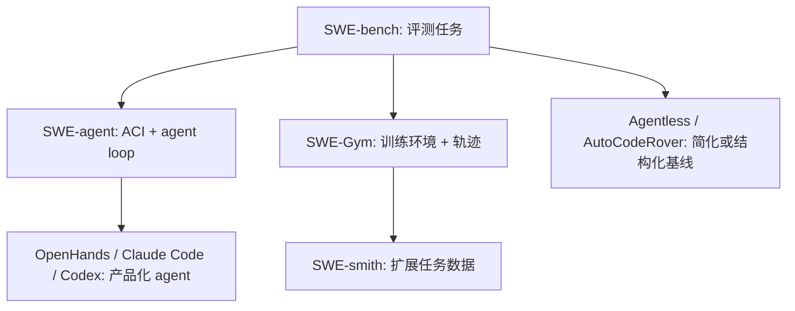

# 第 6 章 案例与论文卡 · 章节总览

⬅ [02-GRPO与长轨迹稳定性](../05-Reward%E4%B8%8E%E7%A8%B3%E5%AE%9A%E6%80%A7/02-GRPO%E4%B8%8E%E9%95%BF%E8%BD%A8%E8%BF%B9%E7%A8%B3%E5%AE%9A%E6%80%A7.md) | ➡ [01-SWE-bench与SWE-agent](01-SWE-bench%E4%B8%8ESWE-agent.md)

## 🎬 故事比喻：参观四个车间

前面几章讲的是“怎么培养一个会修代码的工程师”。这一章去参观真实车间：

- **SWE-bench** 是考试场：拿真实 GitHub issue 考你能不能修。
- **SWE-agent** 是工具台：给模型设计更适合它用的电脑界面。
- **OpenHands / Aider / Claude Code / Codex** 是不同风格的产品车间：有人强调终端结对，有人强调云端并行，有人强调平台化 sandbox。
- **SWE-Gym / SWE-smith** 是训练基地：不只评测，还要造训练任务和轨迹。
- **Agentless / AutoCodeRover** 是反直觉对照组：有时简单、结构化、可解释的流程比复杂 agent 更稳。

## 📑 本章目录

| 小节 | 内容 | 链接 |
|---|---|---|
| 6.1 | SWE-bench 与 SWE-agent | [01-SWE-bench与SWE-agent](01-SWE-bench%E4%B8%8ESWE-agent.md) |
| 6.2 | OpenHands / Aider / Claude Code / Codex 对比 | [02-OpenHands-Aider-ClaudeCode-Codex对比](02-OpenHands-Aider-ClaudeCode-Codex%E5%AF%B9%E6%AF%94.md) |
| 6.3 | SWE-Gym 与 SWE-smith 训练数据 | [03-SWE-Gym与SWE-smith训练数据](03-SWE-Gym%E4%B8%8ESWE-smith%E8%AE%AD%E7%BB%83%E6%95%B0%E6%8D%AE.md) |
| 6.4 | Agentless 与 AutoCodeRover 反直觉基线 | [04-Agentless与AutoCodeRover反直觉基线](04-Agentless%E4%B8%8EAutoCodeRover%E5%8F%8D%E7%9B%B4%E8%A7%89%E5%9F%BA%E7%BA%BF.md) |

## 🔧 技术拆解：本章技术地图

## 🧪 例子：读论文时要问的同一个问题

每读一个案例，都用同一张小表检查：

| 问题 | 目的 |
|---|---|
| 它解决评测、工具、训练、数据还是产品化？ | 避免把不同层级混在一起 |
| 它的 agent 自主度有多高？ | 区分自由 loop 和固定 pipeline |
| 它的 feedback 来自哪里？ | 判断能不能转成 SFT/RL 数据 |
| 它的失败模式是什么？ | 反推本库的工程避坑 |

## ⚠️ 避坑

- 不要只按榜单分数理解论文，要同时看成本、环境、动作空间和数据污染风险。
- 不要把产品功能直接等同于训练方法；产品常常是 scaffold、权限、上下文工程和模型能力的组合。
- 不要忽略强基线，Agentless / AutoCodeRover 这类方法常能提醒我们复杂 agent loop 哪里过度设计。

## 🔗 跨库链接

- Code Agent 定义：[01-Code-Agent与Coder模型边界](../01-Code-Agent%E5%BF%83%E6%99%BA%E6%A8%A1%E5%9E%8B/01-Code-Agent%E4%B8%8ECoder%E6%A8%A1%E5%9E%8B%E8%BE%B9%E7%95%8C.md)
- 工程闭环：[01-Agent工程闭环总览](../04-Agent%E5%B7%A5%E7%A8%8B%E9%97%AD%E7%8E%AF/01-Agent%E5%B7%A5%E7%A8%8B%E9%97%AD%E7%8E%AF%E6%80%BB%E8%A7%88.md)
- Code Agentic RL 专题：[00-章节总览](../../agentic-rl-knowledge-base/04-%E7%AC%AC4%E7%AB%A0-Code-Agentic-RL%E4%B8%93%E9%A2%98/00-%E7%AB%A0%E8%8A%82%E6%80%BB%E8%A7%88.md)
- Claude Code 工业案例：[00-总览](../../Claude-Code-Source/00-%E6%80%BB%E8%A7%88.md)

## ❓ 自测题

- SWE-bench 为什么比 HumanEval 更接近真实软件工程？
- SWE-agent 的 ACI 解决了什么问题？
- 为什么 Agentless 能成为强基线？
- SWE-Gym 和 SWE-smith 分别解决“训练环境”和“数据规模”的哪一部分？
